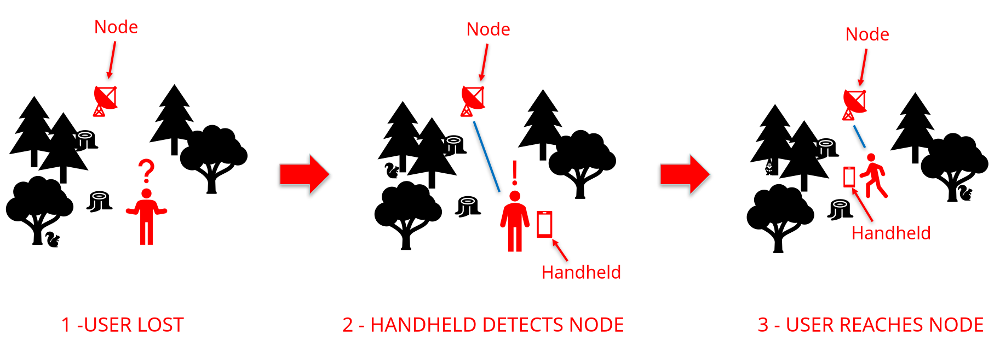
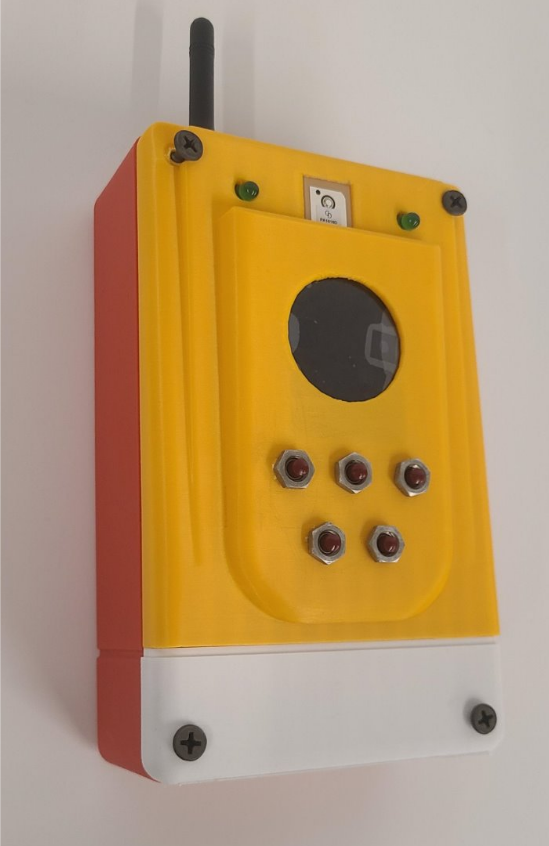
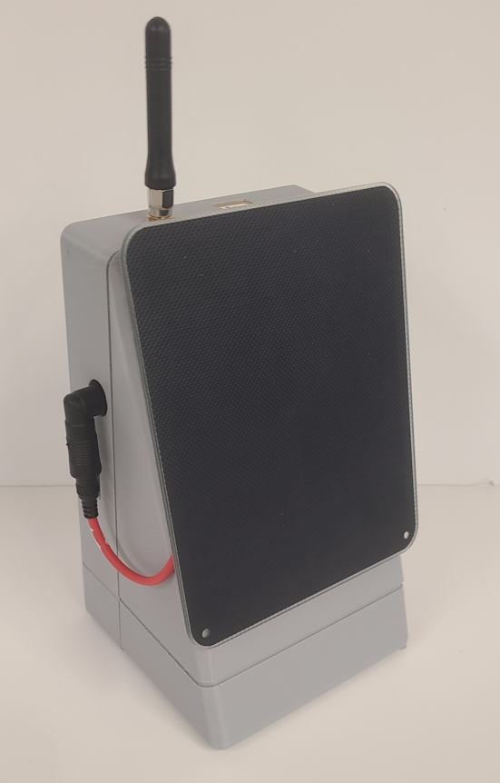
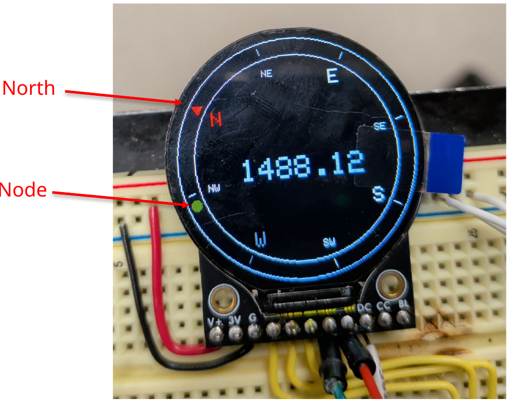
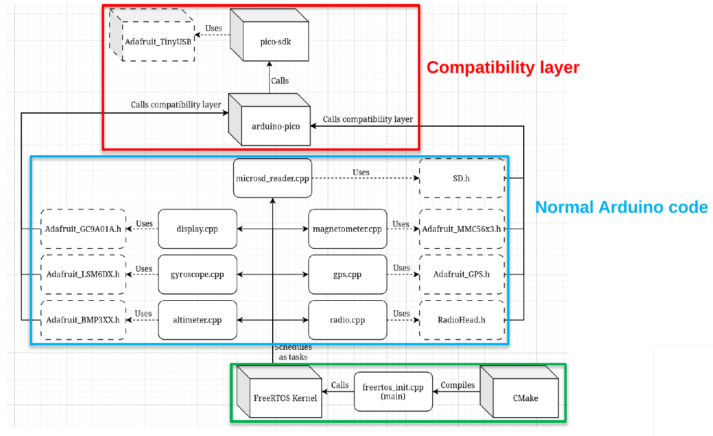
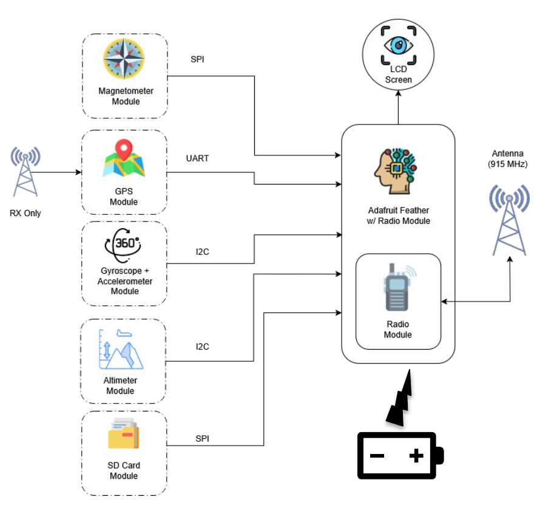
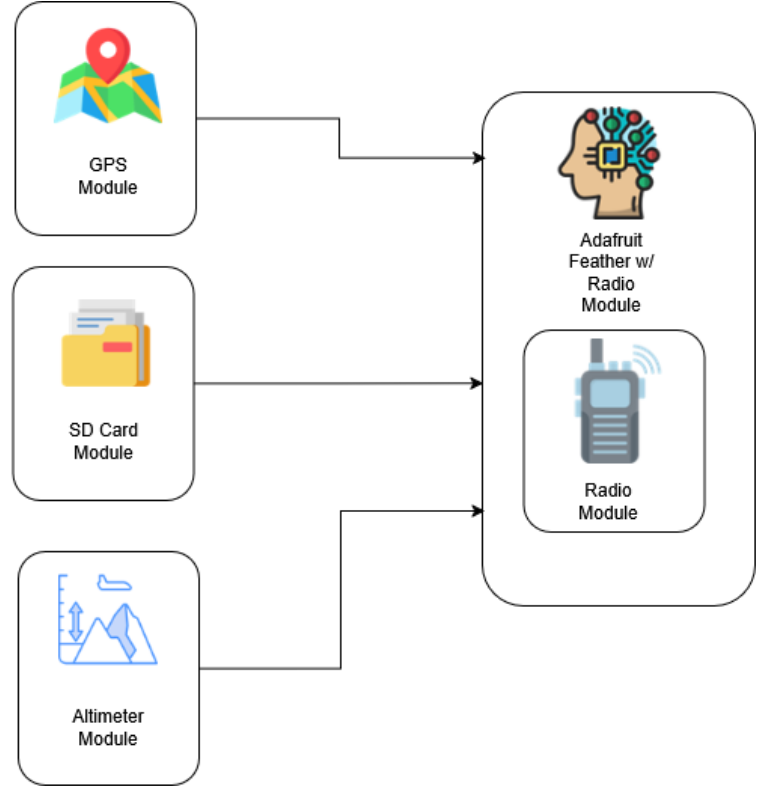

# Electronic Pathfinder (Capstone Project)

- **Institution:** University of Kansas
- **Course:** EECS 542 (Computer Systems Design Lab II)
- **Honors & Awards:** Winner of the Rummer Award (**best overall Capstone Project**)

<figure align="center">
  
</figure>

The Electronic Pathfinder is a handheld system which directs users lost in the wilderness toward a safe location broadcasted via radio by a node, reducing the time and cost for search-and-rescue (SAR) operations. The project consists of two parts: the Handheld system, and the Node system. These devices exchange location data on the 915 MHz ISM band to determine where the user should head toward to find the node, which represents a safe known location.

<table>
  <tr>
    <td align="center">
      <br>
      <em>Figure 1: Electronic Pathfinder's Handheld system.</em>
    </td>
    <td align="center">
      <br>
      <em>Figure 2: Electronic Pathfinder's Node system.</em>
    </td>
  </tr>
  <tr>
    <td align="center">
      <br>
      <em>Figure 3: Caption for Image 3</em>
    </td>
    <td align="center">
      <br>
      <em>Figure 4: Caption for Image 4</em>
    </td>
  </tr>
</table>

# Team roster

- **Leo Cabezas Amigo**: Embedded Systems Lead, UI/UX Software Engineer.
- **Stephen Schmidt**: Project Lead, Software Engineer.
- **Jacob Nonoyama**: UI/UX Software Engineer.
- **Matthew Ridgeway**: Power Systems Engineer.

# Deployment instructions

## A. Required Hardware

### A.1. Handheld hardware

<figure align="center">
  
</figure>
*Figure 5: Handheld hardware diagram.*

| Component | Product link | Relevant standards | Cost |
| :-------- | :-------- | :----------------- | :---------------------- |
| Microcontroller + Radio Transceiver | [Adafruit Feather RP2040 with RFM95 LoRa Radio - 915MHz - RadioFruit and STEMMA QT](https://www.adafruit.com/product/5714) | UART, SPI, I²C, USB | 1 x $29.95 |
| Round Display | [Adafruit 1.28" 240x240 Round TFT LCD Display with MicroSD - GC9A01A with EYESPI Connector](https://www.adafruit.com/product/6178) | SPI | 1 x $17.50
| GNSS (GPS) receiver | [Adafruit Ultimate GPS Breakout with GLONASS + GPS - PA1616D - 99 channel w/10 Hz updates](https://www.adafruit.com/product/5440) | UART | 1 x $29.95 |
| Magnetometer | [Adafruit Triple-axis Magnetometer - MMC5603 - STEMMA QT / Qwiic](https://www.adafruit.com/product/5579) | I²C | 1 x $5.95 |
| Precision Altimeter | [Adafruit BMP390 - Precision Barometric Pressure and Altimeter - STEMMA QT / Qwiic](https://www.adafruit.com/product/4816) | I²C | 1 x $10.95 |
| Accelerometer + Gyroscope | [Adafruit LSM6DSOX 6 DoF Accelerometer and Gyroscope - STEMMA QT / Qwiic](https://www.adafruit.com/product/4438) | I²C | 1 x $11.95 |
| MicroSD reader | [Adafruit Micro SD SPI or SDIO Card Breakout Board - 3V ONLY!](https://www.adafruit.com/product/4682) | SPI | 1 x $3.50 |
| 915MHz radio antenna | [Abracon AEACAC054010-S915 RF Antenna](https://www.digikey.com/short/v0jrp2pc) | N/A | 1 x $6.58 |
| uFL to SMA adapter | [SMA to uFL/u.FL/IPX/IPEX RF Adapter Cable](https://www.adafruit.com/product/1781) | N/A | 1 x $3.95 |
| LiIon battery | [Lithium Ion Cylindrical Battery - 3.7v 2200mAh](https://www.adafruit.com/product/1781) | N/A | 1 x $9.50 |

**Total Handheld cost:** $129.78 (as of 2026-06-21)

### A.2. Node hardware

<figure align="center">
  
  <figcaption>Figure 6: Node hardware diagram.</figcaption>
</figure>

| Component | Product link | Relevant standards | Cost |
| :-------- | :-------- | :----------------- | :---------------------- |
| Microcontroller + Radio Transceiver | [Adafruit Feather RP2040 with RFM95 LoRa Radio - 915MHz - RadioFruit and STEMMA QT](https://www.adafruit.com/product/5714) | UART, SPI, I²C, USB | 1 x $29.95 |
| GNSS (GPS) receiver | [Adafruit Ultimate GPS Breakout with GLONASS + GPS - PA1616D - 99 channel w/10 Hz updates](https://www.adafruit.com/product/5440) | UART | 1 x $29.95 |
| Precision Altimeter | [Adafruit BMP390 - Precision Barometric Pressure and Altimeter - STEMMA QT / Qwiic](https://www.adafruit.com/product/4816) | I²C | 1 x $10.95 |
| MicroSD reader | [Adafruit Micro SD SPI or SDIO Card Breakout Board - 3V ONLY!](https://www.adafruit.com/product/4682) | SPI | 1 x $3.50 |
| 915MHz radio antenna | [Abracon AEACAC054010-S915 RF Antenna](https://www.digikey.com/short/v0jrp2pc) | N/A | 1 x $6.58 |
| uFL to SMA adapter | [SMA to uFL/u.FL/IPX/IPEX RF Adapter Cable](https://www.adafruit.com/product/1781) | N/A | 1 x $3.95 |
| LiIon battery pack | [Lithium Ion Polymer Battery - 3.7v 6600mAh](https://www.adafruit.com/product/353) | N/A | 1 x $24.50 |
| Solar panel | [6V 2W Solar Panel - ETFE - Voltaic P126](https://www.adafruit.com/product/5366) | N/A | 1 x $20.95 |
| Solar panel charge controller | [Adafruit Universal USB / DC / Solar Lithium Ion/Polymer charger - bq24074](https://www.adafruit.com/product/4755) | N/A | 1 x $14.95 |
| Solar panel jack adapter | [3.5mm / 1.1mm to 5.5mm / 2.1mm DC Jack Adapter](https://www.adafruit.com/product/4287) | N/A | 1 x $1.50 |

**Total Node cost:** $146.78 (as of 2026-06-21)

## B. Software dependencies

<figure align="center">
  
  <figcaption>Figure 7: Electronic Pathfinder software stack diagram.</figcaption>
</figure>

### B.1. Required software dependencies

The following is a comprehensive list of all software dependencies that users are **REQUIRED** to install themselves to be able to compile the Electronic Pathfinder repository, along with instructions and useful clarifications.

TO-DO: REVISE MINIMUM REQUIRED VERSIONS, DEP. VERSIONS IN GENERAL

- [**pico-sdk (2.2.0)**](https://github.com/raspberrypi/pico-sdk)
- [**FreeRTOS-Kernel (11.2.0)**](https://github.com/FreeRTOS/FreeRTOS-Kernel)
- [**picotool (2.2.0)**](https://github.com/raspberrypi/pico-sdk-tools/releases) (download precompiled executable from official repo)
- [**CMake (minimum 3.13)**](https://github.com/Kitware/CMake) ---> Must be available in your $PATH
- [**arm-none-eabi-gcc (version?)**]() ---> Must be available in your $PATH
- [**arm-none-eabi-binutils**]
- [**arm-none-eabi-newlib**]

In Debian based systems, do
```
sudo apt-get install build-essential gcc-arm-none-eabi
```

SUPER DUPER EXTREMELY IMPORTANT OR SERIALUSB WILL NOT WORK:
```
cd [path_to_pico_sdk]
```
```
git submodule update --init
```

- [**arm-none-eabi-g++ (version?)**]() => Must be available in your $PATH
- What else? Need to make sure nothing's missing.

Make sure the GNU Arm Embedded Toolchain is installed and available in your $PATH.

### B.2. Pre-installed software dependencies

The Electronic Pathfinder repository already contains most of the required software dependencies for interfacing with the external sensor modules. **The user is NOT required to install these dependencies themselves**; we list them here only for the sake of clarity and transparency:

- [Adafruit_BMP3XX](https://github.com/adafruit/Adafruit_BMP3XX)
- [Adafruit_BusIO](https://github.com/adafruit/Adafruit_BusIO)
- [Adafruit_GC9A01A](https://github.com/adafruit/Adafruit_GC9A01A)
- [Adafruit-GFX-Library](https://github.com/adafruit/Adafruit-GFX-Library)
- [Adafruit_GPS](https://github.com/adafruit/Adafruit_GPS)
- [Adafruit_LSM6DS](https://github.com/adafruit/Adafruit_LSM6DS)
- [Adafruit_MMC56x3](https://github.com/adafruit/Adafruit_MMC56x3)
- [Adafruit_Sensor](https://github.com/adafruit/Adafruit_Sensor)
- [RadioHead](https://www.airspayce.com/mikem/arduino/RadioHead/)
- [SdFat](https://github.com/greiman/SdFat)
- [arduino-pico](https://github.com/earlephilhower/arduino-pico)
- [ArduinoCore-API](https://github.com/arduino/ArduinoCore-API)

## C. Compilation instructions (Linux)

### C.1. Handheld / Node compilation instructions


- **Step 1:** Navigate to /build in your CLI:
```
cd [path_to_earendil-SAR-system]/build
```

- **Step 2:** Generate the project's Makefile using CMake and the provided CMakeLists.txt:

```
cmake .. -DOUTPUT=[HANDHELD / NODE] -DPICO_SDK_PATH=[path_to_pico-sdk] -DFREERTOS_KERNEL_PATH=[path_to_FreeRTOS-Kernel] -DPICOTOOL_PATH=[path_to_picotool]
```

If pico-sdk, FreeRTOS-Kernel, and picotool are all located in your $HOME, you can simply do
```
cmake .. -DOUTPUT=[HANDHELD / NODE]
```
instead.

- **Step 3:** Use the Makefile to generate the project's .uf2 file.
```
make
```
You will use this .uf2 file in section C.2 to program the Adafruit Feather RP2040 + RFM95 via its on-board FLASH memory.

### C.2. File upload instructions

- **Step 1:** Grab a data-capable USB-C cable and plug it into the Feather's USB-C port.
 
- **Step 2** - Press and hold the 'Boot' button on the Adafruit Feather RP2040 + RFM95.

- **Step 3** - While holding the 'Boot' button, plug the other end of the cable into your computer.

- **Step 4** - Release the 'Boot' button. The Feather should be recognized as storage volume 'RPI-RP2'.

- **Step 5** - Mount the 'RPI-RP2' storage volume and upload the project's .uf2 to it.

**Done! The Feather should be now programmed and functional.**

# How it works


