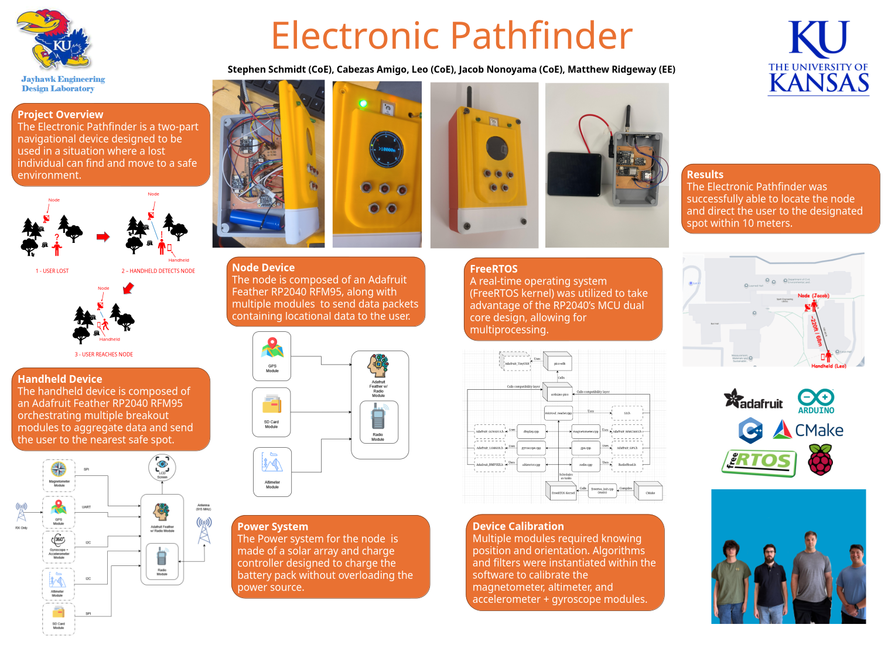

# Electronic Pathfinder (Capstone)

## Overview

Designed and built at the University of Kansas, the Electronic Pathfinder is a handheld system which directs users lost in the wilderness toward a safe location broadcasted via radio by a node, reducing the time and cost for search-and-rescue (SAR) operations. The project consists of two parts: the Handheld system, and the Node system. These systems exchange location data with each other in the 915 MHz ISM radio band, to determine in which direction the user should walk to find the Node, which is to be placed at a safe and well-known location.

## Objectives

- The Handheld system should guide lost users toward the location of the Node, within an accuracy of 10 meters (to accound for GPS fix drift).
- The Pathfinder must be independent of the Internet and cell reception.
- Battery life should allow for continuous operation for a minimum of 48 hours.

## Methodology

Describe your approach and technologies used.

## Results

Summarize your findings and outcomes.

## Final Report

[Download the report](files/capstone-report.pdf)

## Team

- Leo Cabezas Amigo
- Stephen Schmidt
- Jacob Nonoyama
- Matthew Ridgeway

## Repository

[Source Code](https://github.com/username/repository)